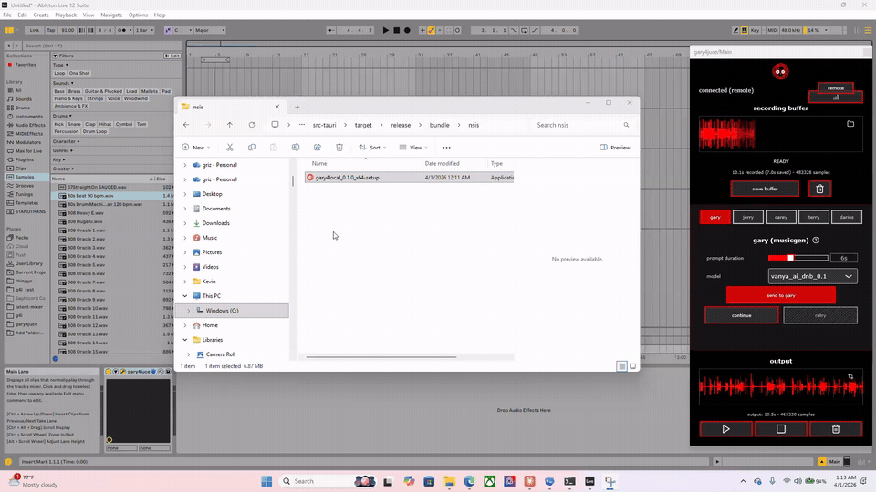

# gary4local

local Windows control center and bundled backend services for [gary4juce v3](https://github.com/betweentwomidnights/gary4juce).

find the macOS version here: <https://github.com/betweentwomidnights/gary-localhost-installer-mac>

This branch is the `v2-refactor` Tauri/Rust implementation. The old PyInstaller/Inno Setup flow is intentionally not part of this branch anymore; that legacy path stays preserved on the old branch history.

## preview

install and startup flow:



## what lives here

- `control-center/`
  Tauri + Svelte desktop app that manages the local services, model downloads, installer flow, tray menu, and production runtime sync into `%APPDATA%\Gary4JUCE`.
- `services/`
  The Python backends and model-specific code for Gary, Terry, Jerry, Carey, and Foundation.
- `keygen_music_for_installer.wav`
  Source loop used to generate the tiny installer music asset. cuz why not?

## services

- `gary` / MusicGen: `http://localhost:8000` via [audiocraft](https://github.com/facebookresearch/audiocraft)
- `terry` / MelodyFlow: `http://localhost:8002` via [MelodyFlow](https://huggingface.co/spaces/facebook/MelodyFlow)
- `carey` / ACE-Step: `http://localhost:8003` via [ACE-Step 1.5](https://github.com/ace-step/ACE-Step-1.5) with localhost `lego`, `complete`, and `cover` mode changes from [ace-lego](https://github.com/betweentwomidnights/ace-lego)
- `jerry` / Stable Audio: `http://localhost:8005` via [stable-audio-open-small](https://huggingface.co/stabilityai/stable-audio-open-small) and [stable-audio-tools](https://github.com/Stability-AI/stable-audio-tools)
- `foundation-1`: `http://localhost:8015` via [Foundation-1](https://huggingface.co/RoyalCities/Foundation-1) and [RC-stable-audio-tools](https://github.com/RoyalCities/RC-stable-audio-tools)

## gary localhost optimizations

The local `gary` service applies several MusicGen inference optimizations that are specific to the localhost deployment:

- `musicgen_fast.py` converts remaining float32 parameters and buffers to fp16 to avoid extra dtype conversion overhead during generation.
- Self-attention layers are patched to use a pre-allocated static KV cache instead of repeatedly growing tensors with `torch.cat`.
- If available in the local Gary environment, Flash Attention 2 is patched in directly for MusicGen self-attention.
- The service performs a small first-load kernel warmup pass per model/device so later generations start faster.

For localhost we intentionally do **not** enable `torch.compile` by default. Gary unloads models after generation so we can support many finetunes on smaller GPUs without keeping large model instances resident, and that model lifecycle usually makes compile overhead a poor tradeoff.

## carey localhost notes

The local `carey` service includes a small-GPU decode strategy that differs from upstream [ace-lego](https://github.com/betweentwomidnights/ace-lego) behavior:

- During decode, localhost Carey can temporarily offload the DiT model so the VAE decode step has more VRAM available.
- The decode path falls back through progressively safer modes, including tiled decode, CPU-offloaded decode, and full CPU decode, instead of hard-failing immediately on lower-memory GPUs.

This helps ACE-Step remain usable on consumer cards where generation may fit in VRAM but decode is the step that would otherwise tip the process into an out-of-memory failure.

## terry localhost optimizations

The local `terry` service now supports an optional Flash Attention 2 path for MelodyFlow on CUDA:

- Terry runs MelodyFlow on `torch 2.7.1` with the same Windows FA2 wheel family used by the other CUDA services.
- `melodyflow_fast.py` patches the DiT self-attention blocks at runtime to call FA2 directly when the wheel is installed and the tensors are in a supported CUDA dtype.
- Cross-attention stays on the existing AudioCraft attention path because those blocks can carry masks, so the FA2 patch stays focused on the large self-attention passes over audio latents.
- The optimization is disabled by default and can be enabled with `MELODYFLOW_USE_FLASH_ATTN=1` or from the `gary4local` Terry panel when that feature is included in the build.

## repo layout notes

- Development runs directly from the repo.
- Production syncs the bundled service source into `%APPDATA%\Gary4JUCE\services`.
- Mutable runtime data such as logs, virtual environments, caches, and models live under `%APPDATA%\Gary4JUCE`, not inside the installed app folder.

## TODO

- [ ] add auto-update functionality (see [AUTO_UPDATE_PLAN.md](AUTO_UPDATE_PLAN.md))

## development

prerequisites:

- Windows 10 or 11
- Node.js 20+
- Rust toolchain for Tauri builds
- WebView2
- `ffmpeg` if you want to regenerate the installer audio asset

run the app in development:

```powershell
cd control-center
npm install
npm run tauri dev
```

## production build

build the installer:

```powershell
cd control-center
npm ci
npm run tauri build
```

if you want a build that hides the experimental Terry Flash Attention toggle entirely, set the feature flag before building:

```powershell
cd control-center
npm ci
$env:VITE_ENABLE_MELODYFLOW_FA2_TOGGLE='0'
npm run tauri build
Remove-Item Env:VITE_ENABLE_MELODYFLOW_FA2_TOGGLE
```

notes:

- `VITE_ENABLE_MELODYFLOW_FA2_TOGGLE` is a build-time flag, not a runtime toggle.
- When this flag is set to `0`, the Terry Flash Attention setting is removed from the UI and the packaged app forces MelodyFlow to stay on the standard attention path.
- Leaving the flag unset keeps the Terry Flash Attention panel available, but the optimization itself still defaults to off unless the user enables it.

artifacts land in:

- `control-center/src-tauri/target/release/bundle/nsis/`
- `control-center/src-tauri/target/release/bundle/msi/`

the current preferred Windows artifact is the NSIS setup executable.

## unsigned builds

the installers are currently unsigned. The intended verification flow is:

1. Build the installer locally from this branch with one of the commands above.
2. Compare the generated hash against the release artifact hash.

example:

```powershell
certutil -hashfile .\control-center\src-tauri\target\release\bundle\nsis\gary4local_0.1.1_x64-setup.exe SHA256
```

## related repos

- plugin frontend: <https://github.com/betweentwomidnights/gary4juce>
