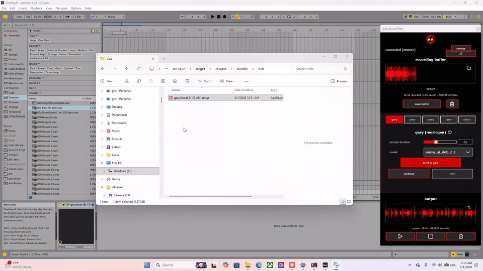

# gary4local

this is a windows control center for running 7 music models directly on your
computer.

use it with [gary4juce](https://github.com/betweentwomidnights/gary4juce)
to run the models inside your DAW, or from the standalone app.

find the macOS version here:
[gary-localhost-installer-mac](https://github.com/betweentwomidnights/gary-localhost-installer-mac).

gary4local is built with Tauri, Rust, and Svelte. the old
PyInstaller/Inno Setup flow remains available in the older branch history.

## update 10/7

now supporting [YuE2](https://github.com/multimodal-art-projection/YuE).
you'll notice the runtime is a little different... we're using C++ (ggml) for
this service, and in the future, all gary4local services will be replaced to
follow this pattern.

this is going to replace the need for a separate gary4local-mac application,
and is going to save us all a lot of storage space when Python is no longer
involved.

plz bear with me as i try to make this migration to C++ as smooth as i can.

## update 8/23

custom runtime storage is now supported. everything should work the same for
existing users, but now you can move the runtime to an external drive or
wherever you please, and clean up the legacy storage afterward if you like.

big thanks to Kostas for helping us validate all of this on the Radeon/ROCm
build while we tried very hard to break it locally.

## v0.4.0

[download gary4local v0.4.0 for Windows](https://github.com/betweentwomidnights/gary-localhost-installer/releases/tag/v0.4.0).

**yuey is here: [YuE2](https://github.com/multimodal-art-projection/YuE), the
seventh model.** we've chosen to do this one in native GGML. there's no Python
environment at all: "install runtime" downloads a prebuilt
[yuey.cpp](https://github.com/betweentwomidnights/yuey.cpp) package for your
GPU (CUDA on NVIDIA, Vulkan on AMD and Intel), checks it, and you're done.

the yuey panel picks the model tier for your GPU, and has a few defaults for
how it handles instrumentals and how long a song it writes for itself. the
storage window now shows native runtimes too, including the shared CUDA
runtime, which you can remove once nothing uses it.

yuey.cpp is now at 0.2.2, fixing the short MIDI score failure that could report
`invalid YuE2 AR sampling configuration`. after updating this app, press
`update runtime` on yuey's row. the natural-length default stays at 96 seconds,
and `copy log` makes it easier to report a slow job.

SA3 and Carey now accept up to 380 seconds locally. longer jobs still depend on
your available memory; the remote frontend limits stay at 240 seconds.

compatible with [gary4juce v5.0.0](https://github.com/betweentwomidnights/gary4juce/releases/tag/v5.0.0).

older release notes now live in [CHANGELOG.md](CHANGELOG.md).

## roadmap

- [ ] replace jerry, foundation-1 and SA3 with [sa3.cpp](https://github.com/betweentwomidnights/sa3.cpp), which already supports LoRA training in native C++
- [ ] replace carey with [acestep.cpp](https://github.com/betweentwomidnights/acestep.cpp), including the LoRA workflow
- [ ] replace melodyflow and musicgen with [audiocraft.cpp](https://github.com/betweentwomidnights/audiocraft.cpp) (LoRA training? might actually be doable)
- [ ] dig into a LoRA training UI for YuE2
- [ ] produce a macOS build of this project and retire [gary4local-mac](https://github.com/betweentwomidnights/gary-localhost-installer-mac) once the native migration is ready
- [ ] produce a Linux build
- [ ] launch the web UIs for sa3.cpp, acestep.cpp and yuey.cpp directly from gary4local

how every native service is packaged and installed is in
[native runtime packages](docs/native-runtime-packages.md).

## preview

install and startup flow:



## what lives here

- `control-center/`
  the Tauri + Svelte desktop app that manages the local services, model downloads, installer flow, tray menu, and production runtime sync into the selected runtime storage folder.
- `services/`
  the Python backends and model-specific code for gary, terry, jerry, carey,
  foundation, and sa3, plus the manifest entry for yuey, whose native runtime
  is downloaded rather than built.
- `keygen_music_for_installer.wav`
  source loop used to generate the tiny installer music asset. cuz why not?

## services

- `gary` / MusicGen: `http://localhost:8000` via [audiocraft](https://github.com/facebookresearch/audiocraft)
- `terry` / MelodyFlow: `http://localhost:8002` via [MelodyFlow](https://huggingface.co/spaces/facebook/MelodyFlow)
- `carey` / ACE-Step: `http://localhost:8003` via [ACE-Step 1.5](https://github.com/ace-step/ACE-Step-1.5) with localhost `lego`, `extract`, `complete`, and `cover` mode changes from [ace-lego](https://github.com/betweentwomidnights/ace-lego)
- `jerry` / Stable Audio: `http://localhost:8005` via [stable-audio-open-small](https://huggingface.co/stabilityai/stable-audio-open-small) and [stable-audio-tools](https://github.com/Stability-AI/stable-audio-tools)
- `sa3` / Stable Audio 3: `http://localhost:8006` via [stable-audio-3](https://github.com/stability-ai/stable-audio-3)
- `foundation-1`: `http://localhost:8015` via [Foundation-1](https://huggingface.co/RoyalCities/Foundation-1) and [RC-stable-audio-tools](https://github.com/RoyalCities/RC-stable-audio-tools)
- `yuey` / YuE2: `http://localhost:8007` via [yuey.cpp](https://github.com/betweentwomidnights/yuey.cpp), a native GGML build of [YuE2](https://github.com/multimodal-art-projection/YuE)

## LoRA training

LoRA training lives in gary4local. the service panels open the local trainers;
the plugin loads the resulting adapters for generation. the current workflows
still use Python, and preserving training is part of the native migration.
see the [ACE-Step training guide](docs/ace-step-lora-training.md) and
[SA3 service notes](services/sa3/README.md).

## custom model backends

for more info about some of the custom model backends and localhost-specific
optimizations in this project, see the
[custom model backend notes](docs/custom-model-backends.md).

## repo layout notes

- development runs directly from the repo.
- production syncs the bundled service source into the selected runtime storage folder under `services`.
- new installs default runtime storage to `gary4local-data` inside the install folder, so choosing an external install drive also moves service envs, caches, logs, and local models there.
- existing installs keep using `%APPDATA%\Gary4JUCE` when data is already present. the storage button in the app can choose a new folder for the next restart.

## auto-updater

this project has an auto-updater inside the UI. you can read about how that's
handled in the [auto-updater notes](docs/auto-updater.md), or just build it
without one:

```powershell
cd control-center
npm ci
$env:VITE_ENABLE_APP_UPDATER='0'
npm run tauri build
Remove-Item Env:VITE_ENABLE_APP_UPDATER
```

that flag removes the updater UI and manifest checks from the build.

## development

prerequisites:

- Windows 10 or 11
- Node.js 20+
- Rust toolchain for Tauri builds
- WebView2
- `ffmpeg` if you want to regenerate the installer audio asset

run the app in development:

```powershell
cd control-center
npm install
npm run tauri dev
```

## production build

build the installer:

```powershell
cd control-center
npm ci
npm run tauri build
```

the build now stages `control-center/src-tauri/resources/services` automatically from the tracked repo `services/` tree, so a clean clone doesn't need a pre-populated bundled-services folder or extra `bash` / `rsync` tooling just to package the app.

if you want a build that hides the experimental Terry Flash Attention toggle entirely, set the feature flag before building:

```powershell
cd control-center
npm ci
$env:VITE_ENABLE_MELODYFLOW_FA2_TOGGLE='0'
npm run tauri build
Remove-Item Env:VITE_ENABLE_MELODYFLOW_FA2_TOGGLE
```

notes:

- `VITE_ENABLE_MELODYFLOW_FA2_TOGGLE` is a build-time flag, not a runtime toggle.
- when this flag is set to `0`, the terry Flash Attention setting is removed from the UI and the packaged app forces MelodyFlow to stay on the standard attention path.
- leaving the flag unset keeps the terry Flash Attention panel available, but the optimization itself still defaults to off unless the user enables it.

artifacts land in:

- `control-center/src-tauri/target/release/bundle/nsis/`
- `control-center/src-tauri/target/release/bundle/msi/`

the current preferred Windows artifact is the NSIS setup executable.

## unsigned builds

the installers aren't Authenticode-signed. in-app updates use a separate
updater signature checked against the public key built into the app.
for a manual download, compare the file's SHA-256 with the release asset digest.
rebuilding locally isn't expected to produce an identical installer hash.

example:

```powershell
certutil -hashfile .\control-center\src-tauri\target\release\bundle\nsis\gary4local_<version>_x64-setup.exe SHA256
```

## related repos

- plugin frontend: <https://github.com/betweentwomidnights/gary4juce>
- lora examples: <https://github.com/betweentwomidnights/gary-lora-examples>
